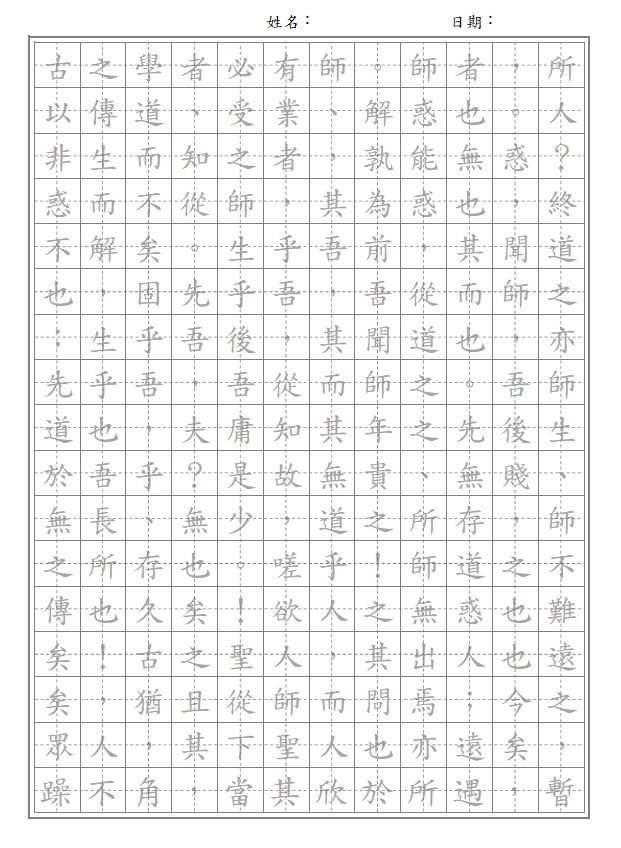
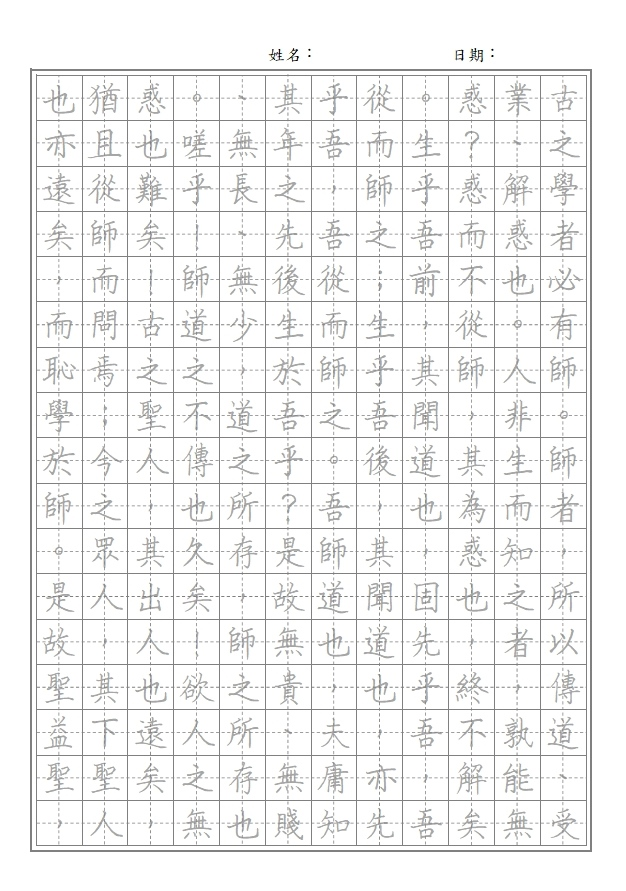

# WriteMate 字帖產生器 SDD

## 1. 簡介

### 1.1 背景
WriteMate 是一款協助硬筆書法與鋼筆練字者快速製作字帖的 Web App。多數學習者需要大量客製化練習紙，包括不同的字型、行距，以及個別應用情境（如姓名、文章、楷書臨摹）。市面上的線上工具功能偏少且輸出品質不一，WriteMate 致力於提供高品質、可列印的 A4 練字範本，並支援多語系文字排版。

### 1.2 產品目標
- 操作流程維持在「選模板 → 輸入文字 → 調整設定 → 預覽/列印」的短路徑體驗。
- 現況聚焦文章模板（橫排／直排），維持 15mm 田字格與 A4 列印尺寸正確。
- 保持輸出向量化，確保列印清晰且易於後續擴充其他模板。

### 1.3 定義
- 字帖：包含字型、字距、田字格、參考文字等元素，供使用者臨摹。
- 模板：針對不同練字情境（單字、姓名、文章）設計的排版與輸出邏輯。
- 田字格：1.5cm x 1.5cm 的基準格線，用於指導筆畫。

## 2. 範疇

### 2.1 In Scope
- 單頁 A4 文章模板（橫式／直式，17×12 共 204 格），右至左直排與左至右橫排。
- 田字格型態切換（田字／米字／九宮格）、格線顏色調整、雙層外框與虛線導引。
- 參考文字顯示開關與透明度；字型／字級／文字顏色選擇。
- 頂端姓名／日期標籤、上方額外留白（6mm）確保列印時頁首空間。
- 預覽（SVG）與 PDF 下載（pdf-lib + fontkit，向量輸出）。
- 縮放控制、超量字數警示（僅輸出第一頁）、設定快取與 3 組歷史預設（LocalStorage）。

### 2.2 Out of Scope
- 行動 App（iOS/Android 原生）。
- 後端帳號／雲端儲存、多頁 PDF 生成、自動分頁。
- 自訂字型上傳、批次字帖產生、線上代印與宅配服務。

## 3. 目標使用者與情境

### 3.1 Personas
1. **自修學生 Alice (18 歲)**：準備書法比賽，需要快速產生大量姓名與文章模板，偏好電腦操作。
2. **補習班教師 Ben (35 歲)**：為學生製作課後練習紙，希望可批次輸入生字列表並列印。
3. **設計師 Carol (28 歲)**：對字帖的版面與字型美感要求高，需要可微調顏色與輔助線。

### 3.2 User Stories
- 作為學員，我希望輸入一段文章並自動切分到田字格，以便練習長文。
- 作為老師，我希望儲存常用設定（字型、大小）並快速套用，節省備課時間。
- 作為設計師，我希望預覽時能放大檢視細節，確保列印品質。

## 4. 功能需求

### 4.1 核心功能概述
| 模組        | 功能                         | 說明                                                            |
| ----------- | ---------------------------- | --------------------------------------------------------------- |
| 模板選擇    | 文章橫式 / 文章直式          | 固定 17×12（204 格），橫排與直排切換。                          |
| 字體管理    | 內建 5 款字型                | 使用 Web Font 呈現；辰宇落雁體內嵌至 PDF，其他採系統/替代字型。 |
| 文字輸入    | 單段文章                     | 顯示字數與超量提醒，超過 204 字僅輸出首頁。                     |
| 格線設定    | 田字 / 米字 / 九宮格，格線色 | SVG 繪製虛線導引，雙層外框。                                    |
| 參考字      | 顯示/隱藏 + 透明度           | 可依需求淡化示範字。                                            |
| 預覽 & 縮放 | 即時 SVG 預覽，60-140% 縮放  | 與 PDF 輸出佈局一致。                                           |
| 輸出        | PDF 下載                     | A4 單頁，向量格線與字型（含 fontkit）。                         |
| 設定保存    | LocalStorage                 | 保留當前設定與最近 3 筆預設快照。                               |

### 4.2 詳細需求（現況）
- 模板：僅文章模板，橫排或直排；格子 15mm × 15mm，左右上下邊界 15mm，額外頂部留白 6mm 置放姓名/日期。
- 文字：無最小字數限制，最大建議 204 字；超量顯示警示且只匯出首頁。
- 參考字：使用者輸入文字即為參考層，可開關並調透明度。
- 格線：田字、米字、九宮格三種；主格線 0.8pt，導引線為虛線；外框雙層（0.8pt + 2.5pt）。
- 色彩：可選格線色與文字色；提供色票與自訂色碼輸入。
- 字型與大小：5 款內建字型，字級可調；PDF 嵌入辰宇落雁體，其餘使用系統可用字型。
- 預設保存：可儲存 3 筆歷史設定快照（含模板與顏色字型等）。

### 4.3 手寫字型支援清單（現況）
| 字型名稱                    | 來源                                                               | PDF 嵌入               | 特性與使用情境                 |
| --------------------------- | ------------------------------------------------------------------ | ---------------------- | ------------------------------ |
| 辰宇落雁體 Thin             | [Chenyu-otf 專案](https://github.com/Chenyu-otf/chenyuluoyan_thin) | 是（下載並子集化）     | 細緻楷書筆觸，作為主要示範字。 |
| cwTeX 楷體                  | 中央研究院開源字型                                                 | 否（使用系統可用字體） | 端正楷書，教學常用。           |
| Klee One                    | Google Fonts                                                       | 否                     | 日系手寫風格。                 |
| Source Han Serif (思源宋體) | Adobe/Google                                                       | 否                     | 高辨識宋體，跨語系。           |
| 迷你繁楷                    | 開源社群授權                                                       | 否                     | 筆畫較粗，適合初學者。         |

## 5. 非功能需求
- **效能**：主要操作皆在前端完成；PDF 生成於主執行緒，現階段頁面量（單頁）無卡頓，後續再評估 Web Worker。
- **相容性**：目標支援 Chrome/Edge/Safari 最新兩個主版本，解析度 ≥ 1280px；需在平板 Safari 驗證列印。
- **可及性**：色彩對比與控制尺寸需符合 WCAG AA；保留鍵盤操作與 aria-label。
- **安全**：不存後端個資，僅暫存於瀏覽器；暫不開放字型上傳。
- **本地化**：目前僅中文 UI，英文切換列入後續規劃。

## 6. 系統架構與技術堆疊
- 前端：React + Vite + TypeScript，Zustand 管理設定與 3 筆歷史快照。
- 預覽：SVG 繪製格線與文字，與 PDF 佈局一致。
- PDF：pdf-lib 搭配 fontkit 產生 A4 單頁 PDF，向量格線、辰宇落雁體子集嵌入。
- 儲存：LocalStorage 持久化設定與預設快照。
- 後端：無（純前端運行，無遙測）。

### 6.1 模組互動流程（現況）
1. 使用者調整設定，Zustand 同步狀態並立即觸發 SVG 重繪。
2. 下載 PDF 時，使用相同狀態重新繪製並嵌入字型後輸出 Blob。
3. 超量字數僅提示，不自動分頁；只生成單頁 PDF。

## 7. UI/UX 規劃（現況）
- 版面：左側控制面板（模板、文字、字型、格線、顏色、預設），右側預覽／下載區；窄螢幕改為單欄堆疊。
- 預覽：SVG 畫布，提供 60-140% 縮放滑桿與超量提示；可滾動檢視，不支援分頁切換或拖曳移動畫布。
- 視覺：墨黑 + 暖奶白 + 墨綠，細線條與圓角卡片風格。
- 動態：按鈕與卡片有 hover/active 微動態；無新手導覽。
- 標頭：頁首呈現標語區塊，字帖頁面頂部顯示姓名／日期標籤。

## 8. 字帖模板與生成邏輯（現況）
- **模板**：文章橫式／直式，17 行 × 12 列，格子 15mm；左右上下邊界 15mm，額外頂部留白 6mm 放置姓名/日期。
- **格線繪製**：SVG/PDF 向量繪製；田字/米字/九宮格導引線為虛線；外框雙層（0.8pt + 2.5pt）。
- **字元排版**：橫排自左至右填入；直排自右至左、上至下填入；無自動分頁，204 字以內完整呈現，超量提示。
- **參考字層**：同輸入文字；可隱藏並調透明度。
- **顏色與字型**：格線色、文字色可自訂；字型與字級可調，辰宇落雁體嵌入 PDF。

## 9. API 與資料模型 (若採用後端)

### 9.1 資料模型
- `TemplateConfig`: id, type, rows, columns, gridType, fontFamily, fontSize, textColor, gridColor, padding.
- `WorksheetRequest`: templateConfigId, payloadText, locale, showReference, metadata (client info)。
- `WorksheetDocument`: downloadUrl, checksum, expiresAt。

### 9.2 API 介面
| 方法 | 路徑                 | 說明                                 |
| ---- | -------------------- | ------------------------------------ |
| GET  | /api/templates       | 取得模板定義與預設參數               |
| POST | /api/worksheets      | 接收輸入並返回 PDF 下載網址或 Base64 |
| GET  | /api/worksheets/{id} | 查詢生成狀態與下載連結               |

MVP 可直接在前端生成 PDF，後端 API 後續視儲存與權限需求導入。

## 10. 列印與輸出規格（現況）
- A4 210mm × 297mm，邊界 15mm，額外頂部留白 6mm；格子 15mm，向量輸出。
- 單頁 PDF，超過 204 字僅提示不分頁。
- 辰宇落雁體嵌入；其他字型依瀏覽器可用字體呈現。
- 建議列印時關閉縮放、使用實際尺寸。

## 11. 測試策略
- **單元測試**：檢查模板計算函式（行列、換頁）、顏色轉換、字數限制。
- **整合測試**：E2E (Playwright) 模擬從輸入到下載流程，驗證 PDF 內容。
- **視覺測試**：截圖比對預覽畫面與基準圖。
- **列印測試**：實際列印 3 種模板，測量格線尺寸。

## 12. 風險與緩解方案
| 風險                   | 影響         | 緩解                                             |
| ---------------------- | ------------ | ------------------------------------------------ |
| 不同瀏覽器列印縮放差異 | 格線尺寸不準 | 提供列印教學與自動加入比例校正標記               |
| 自訂字型授權問題       | 可能侵權     | 初期僅提供開源或授權字型，後續引導使用者確認授權 |
| 大量文字渲染效能       | 預覽卡頓     | 使用 Virtualized rendering、Web Worker 生成 PDF  |
| 多語系排版（直排）複雜 | 排版錯誤     | 先針對常見語系（中文）優化，逐步擴充             |

## 13. 附件
- 參考效果圖：
    - 
    - 
